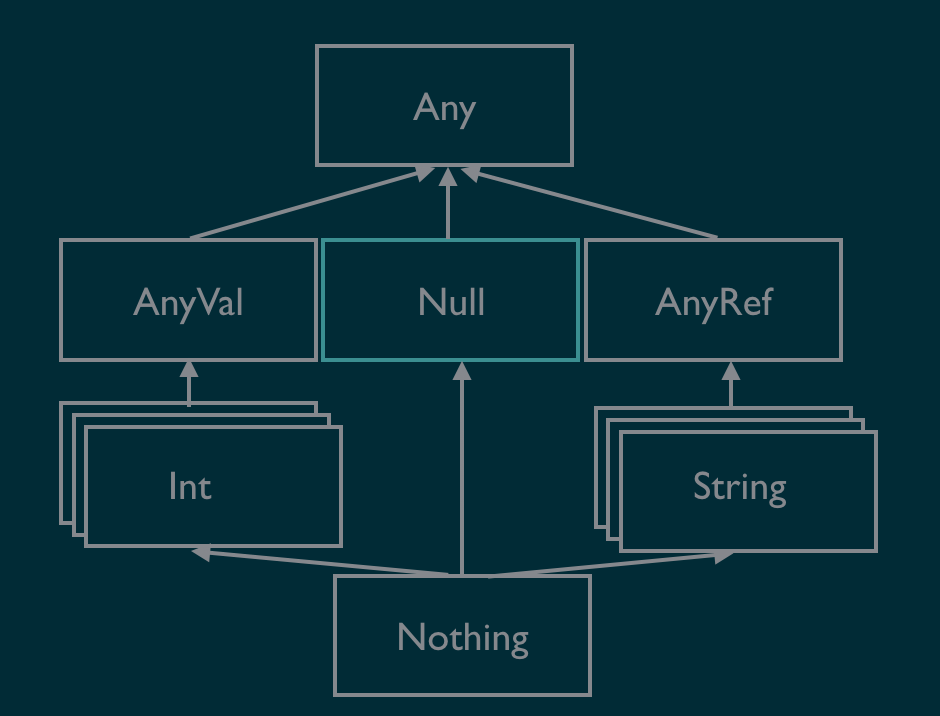
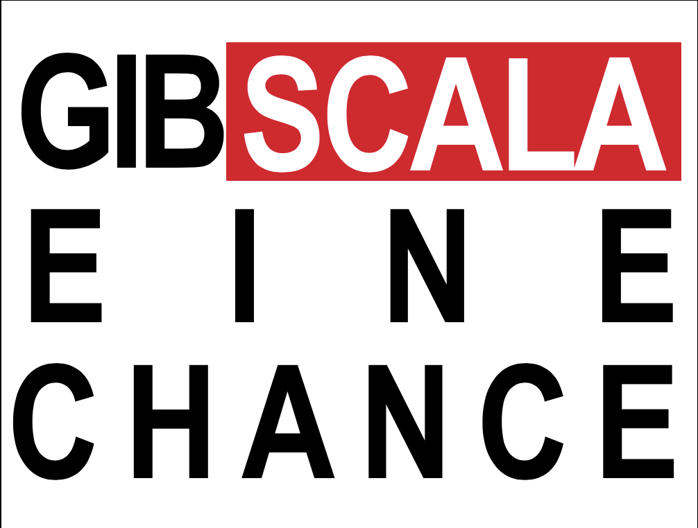

<!--s-->
# Scala 3 
# Gefühl und Härte
Stefan López Romero - MaibornWolff GmbH


<!--v-->
<!-- .slide: data-background="./assets/scala3.png" -->

Note:
* Berliner New Wave-Gruppe
* "Gefühl Und Härte" (1981)
* Passt zu Scala 3 Entwicklung
    * Gefühl: Es wird viel für eine sanfte Migration getan
    * Härte: Fallstricke und Stolpersteine werden entfernt / ersetzt / verbessert

<!--v-->
## Über mich
* IT Architekt MaibornWolff Gmbh 
* Muttersprache: Java
* Hobby: FP mit Scala, Haskell, Kotlin...

<!--v-->
## Ziel
* Wichtigsten Scala 3 Features zeigen
* Lust auf Scala machen
* __Keine__ vollständige Liste an Feature
* __Keine__ Scala Einführung

<!--v-->
## Agenda
* Intro - Was ist Scala 3
* Neue Features
* Outro - Zusammenfassung

<!--s-->

# Intro

<!--v-->
## Scala 3 - Codename Dotty 
* Start 2013: Projekt [Dotty](https://dotty.epfl.ch/)
* Dezember 2019: Feature Complete
* Ende 2020: Erstes Release

<!--v-->

## Was bringt Scala 3
* Neue theoretische Basis: [DOT-Kalkül](https://www.scala-lang.org/blog/2016/02/03/essence-of-scala.html)
* Compiler rewrite 
* TASTY: Kompatibles Zwischenformat
* Viele neue Features

Note:
* DOT: Dependent Object Types 
    * Basis für das Typ System 
    * Ermöglicht Union Types Intersection types...
* TASTY: typed abstract syntax trees Y
    * Scala Kompatiblitätsprobleme Class-Files unterschiedlicher Versionen
    * Class files sind zu konkret
    * Tasty files ermöglichen Backward und forward Compability
    * Scala 3 mit Scala 2 Libs
    * Alle Scala 3.x Versionen werden kompatibel sein

<!--v-->
## Ziele der neuen Features
* Mächtige Konstrukte bändigen
* Unstimmigkeiten und Fallstricke entfernen
* Konsistenz und Ausdruckskraft verbessern
* Bestehende Lücken füllen

<!--s-->
# Neue Features

<!--v-->
## Top Level Definitions

* Es sind keine Wrapper Objekte mehr notwendig
* Package Objects werden dadurch obsolet

```scala
val greeting = "Dear"

case class Person(firstName: String, lastName:String)

def name(p:Person) : String = s"$greeting ${p.firstName} ${p.lastName}"
```

Note:
* Package Objects Scala 2.8 eingeführt
* vgl. Beliebig viele Top-Level Defs pro package
* Eine Datei src.scala wird zum Objekt src$package 

<!--v-->
## Creator Applications
in Scala 3 kann man Klassen ohne das Keyword `new` instanzieren, auch wenn sie keine _apply_-Methode haben. 

```scala
val sb = StringBuilder("abc")
```

Note:
* bessere Lesbarkeit 
* konsistent zu case classes

<!--v-->
## @main functions
Folgendes
```scala
def main(args: Array[String]): Unit = 
    println(s"Hello World")
```
ist nicht mehr notwendig
```scala
@main def hello(): Unit = 
    println(s"Hello World")
```
funktioniert auch mit Argumenten
```scala
@main def sayHello(name: String, age: Int): Unit = 
    println(s"Hello $name, you are $age years old")
```
Notes:
* Generiert eine Klasse mit dem Namen der Funktion
* darin eine main Methode
* Commandline args werden geparsed und fehlerhandling

<!--v-->

## Indentation-based / brace-less syntax
Einrückungen und neue Keywords ersetzen Klammern

```scala
object Algorithm:

    def calc(a: Int, b: Int) : Int =
        var res = a * b
        var c = a
        while c <= b do 
            res * b
            c = c + 1
        res
    
    @main def testCalc(a: Int, b: Int) =
        val result = calc(a, b)

        if result > 1000 then 
            println("result is greater than 1000")
        else
            println("result is smaller than 1000")

```
Note:
* Am meisten Aufregung
* experimental
* optional mit oder ohne 

<!--v-->
## Opaque Type Aliases
Opaque Typ-Aliase bieten eine Typ-Abstraktion ohne jeglichen Overhead

```scala
object OpaqueType {

    opaque type Nat = Int

    object Nat {    
        def apply(d: Int): Nat = 
            if(d >= 0) then d 
                else throw Exception("Nat must be positiv")
    }
}

@main def test(): Unit = {
    import OpaqueType._
    val n = Nat(1)
    val i: Int = n //error: found OpaqueType.Nat, required Int
}
```
Note:
* Innerhalb des Objects `OpaqueType` ist Int und Nat identisch
* Außerhalb nicht
* AnyVal ähnlich aber Overhead durch boxing bei Listen 

<!--v-->
## Enums
Neues Sprach-Konstrukt zur Definition von Enums.

```scala
enum State /* extends java.lang.Enum[State] */{
    case Solid, Liquid, Gas, Plasma
}
```
Enum-Methoden
```scala
scala> State.Solid.ordinal
val res2: Int = 0

scala> State.values
val res0: Array[State] = Array(Solid, Liquid, Gas, Plasma)

scala> State.valueOf("Gas")
val res1: State = Gas
```

Note:
* `sealed case object` keine enum-Methoden, viele Objekte
* Erweiterung `Enumeration` nicht typsicher (zwei Enums können austauschbar verwendet werden) 
* `Enumeration` pattern matching keine Prüfung für alle Fälle
* Arbeiten nicht mit java Enums zusammen

<!--v-->
## Enums
Parametrisierte Enums
```scala
enum Emoticons(icon: String):
    case Smile extends Emoticons(":)")
    case Angry extends Emoticons(":(")
    case Kiss extends Emoticons(":*")
```

Enums als ADTs

```scala
enum Option[+T]:
  case Some(x: T) : extends Option[T]
  case None       : extends Option[Nothing]
```

Note:
* extends kann weggelassen werden
* Covariant (wie hier) type parameter werden minimized -> Bottom type
* Contravariant type parameter werden maximized

<!--v-->
## Extension Methods
Definition
```scala
object StringExtensions: 
    def (str: String) toCamelCase: String = 
        str.toLowerCase.split("\\s").foldLeft("")((acc, elem) => 
            s"$acc${elem.substring(0,1).toUpperCase}${elem.substring(1)}")

```
Nutzung
```scala
@main def toCamelCase(str: String) : Unit = 
    import StringExtensions._
    println(str.toCamelCase)
```

Note:
* Bisher Implicit Classes 
* Implicits werden in Scala 3 weniger verwendet. siehe später
* Auch Generics und operatoren möglich 

<!--v-->
## Union Types
Werden durch die Notation `A|B` definiert

```scala
def size(number: String | Int): Int = 
    number match 
        case s: String => s.size
        case n: Int => n

val numberSize  = size(1234)   //1234
val stringSize  = size("1234") //4
```
Note:
* Funktionale Variante von Subtyping
* Leichtgewichtiger und intuitiver
* nützliches Konstrukt, wenn es darum geht, bestehenden dynamisch typisierten APIs Typen zu geben.

<!--v-->
## Intersection Types
Werden durch die Notation `A&B` definiert
```scala
trait UpperCaseable: 
  def uppercase(s: String) : String =  s.toUpperCase

trait Reversable: 
  def reverse(s: String) : String = s.reverse
    
def convert(in: String, c: UpperCaseable & Reversable) : String = 
    c.uppercase(c.reverse(in))

class Converter 
  extends UpperCaseable with Reversable

@main def testIntersection() = 
    println(convert("racecar", Converter())) //RACECAR
```
Note:
* Vorhandene Typen zusammenfügen, um einen neuen Typ zu erhalten, der alle erforderlichen Funktionen aufweist. 
* Ersetzen compound types A with B 

<!--v-->
## Explicit Nulls

* opt-in Feature
* Modifiziert das Typ-System
* Referenz-Typen werden non-nullable

 <!-- .element height="50%" width="50%" -->

<!--v-->
## Explicit Nulls

```scala

def reverse(string: String|Null ): String = 
        string match
            case s: String => s.reverse
            case _ => ""

def upperReverse(string: String): String = 
    val res: String|Null = string.toUpperCase
    if res != null then res.reverse else "" //flow typing

@main def test():Unit =
    val r1 = reverse(null)
    val r2 = reverse("racecar")
    val r3 = upperReverse(null) // Found: Null Required: String
```

<!--v-->
## Implicits turn into Givens

<!--v-->
<!-- .slide: data-background="./assets/greatePower.jpg" -->

Note:
* Implicits bekannteste und auch gefürchtetste Feature von Scala. 
* mächtiges Paradigma für eine Vielzahl von Anwendungsfällen
* Typ-Klassen, Dependency-Injection, extension methods, implicit conversion... 
* Vielzahl von Einsatzmöglichkeiten und die einfache Deklaration
* Gefahr, dieses mächtige Konstrukt 
    * im falschen Kontext, 
    * zu häufig oder 
    * zu leichtsinnig einzusetzen.

<!--v-->
## Given Instances

```scala
trait Monoid[T]:
    def combine(a: T, b: T) : T
    def unit : T

```
```scala
given sumMonoid as Monoid[Int]: 
    def combine(a: Int, b: Int) : Int =
        a + b
    def unit : Int = 0

given strMonoid as Monoid[String]: 
    def combine(a: String, b: String) : String =
        a + b
    def unit : String = ""
```
Das Keyword `given` soll die Intension besser greifbar machen
<!--v-->

## Using Clauses

```scala
object MonoidOps
    def reduce[T](x: List[T])(using m: Monoid[T]) : T = 
        x.foldLeft(m.unit)(m.combine)
```
Compiler sucht im Scope nach einger `given`-Instance mit dem passenden Typ

<!--v-->
## Given Import

```scala
@main def monoidTest(): Unit = 
    import Monoids.{given _, _}
    println(reduce(List(1,2,3,4))) //10
    println(reduce(List("Hello", " World"))) //Hello World

```
Verhindert, dass durch einen Wildcard import versehentlich `given`-Intances in den Scope gelangen

<!--v-->
## Und noch vieles mehr
* Match types
* Type lambdas
* Dependent Function types
* Kind Polymorphism
* ...

Siehe: [Dotty Documentation](https://dotty.epfl.ch/docs/index.html)
<!--s-->

# Outro

<!--v-->
## Zusammenfassung
* Scala 3 erleichtert den Einstieg in die Sprache 
* Viele Verbesserungen und neue Features für die tägliche Arbeit
* Die meisten neuen Konstrukte existieren erstmal parallel zu den alten
* Mit TASTY als Zwischenformat wird eine sanfte Migration möglich sein
* Rewrite Tools sollen bestehenen Scala 2 Code größtenteils zu Scala 3 umschreiben können

<!--v-->
## Dankeschön :) und...
 <!-- .element height="60%" width="60%" -->
<!--s-->

